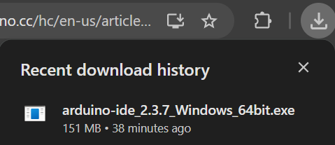
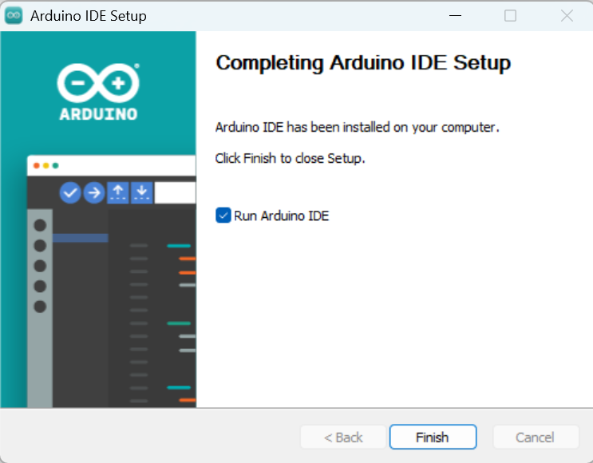
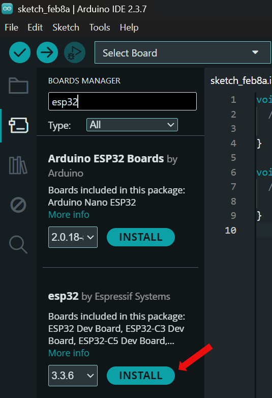
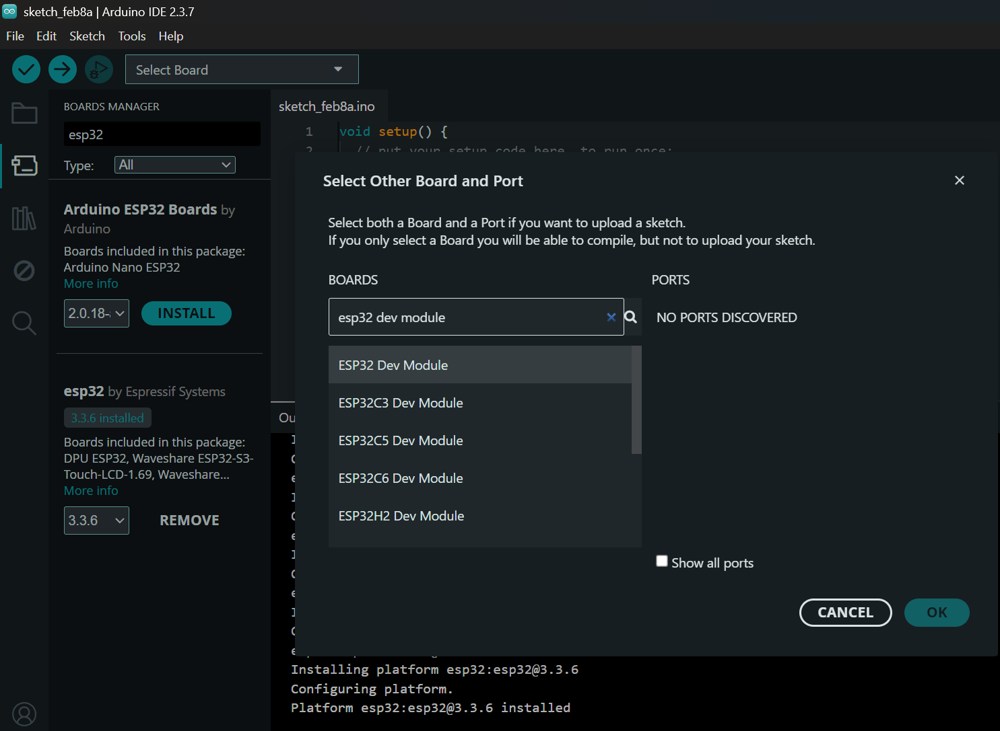
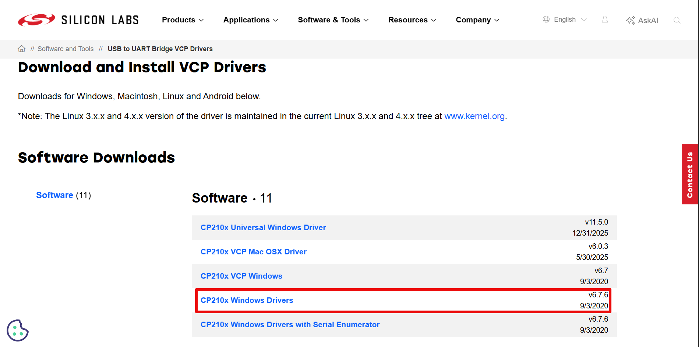

# Arduino IDE

Arduino Integrated Development Environment (IDE) merupakan perangkat lunak *open-source* yang berfungsi sebagai alat antara pengembang dan perangkat keras IoT. Aplikasi ini dirancang untuk memudahkan proses penulisan kode, pengujian, hingga pengunggahan program ke berbagai jenis mikrokontroler dalam ekosistem Arduino maupun modul pihak ketiga. 

File kode yang ditulis pada Arduino IDE dengan menggunakan bahasa pemrograman C++ dalam format file `.ino`.

Berikut proses instalasi aplikasi beserta konfigurasi hingga aplikasi siap digunakan pada project IoT.

## Instalasi

1. **Akses *link*** berikut untuk men-*download* aplikasi Arduino IDE: [Download dan install Arduino IDE](https://support.arduino.cc/hc/en-us/articles/360019833020-Download-and-install-Arduino-IDE).

2. **Pilih *link*** pengunduhan berdasarkan sistem operasi yang digunakan pada masing-masing perangkat Anda.

3. Setelah file berhasil diunduh, **akses file** dengan format `.exe`. Kemudian, ikuti langkah berikutnya untuk menginstal aplikasi.

    

4. Instalasi berhasil dan aplikasi akan terbuka.

    

## Konfigurasi

Untuk melakukan konfigurasi disesuaikan dengan penggunaan jenis mikrokontroler yang akan digunakan.

> **Note!** Dalam *case* ini diberikan contoh instalasi module pada mikrokontroler ESP32.

1. **Buka** bagian BOARDS MANAGER → search "esp32". Kemudian **install** module **ESP32 oleh Espressif Systems**.

    

2. Kemudian, **pilih board** yang akan digunakan yaitu search "esp32 dev module".

    

3. Selanjutnya, **instalasi port** yang berfungsi untuk menghubungkan perangkat keras ESP32 dengan kode program. Berikut *link*: [Instalasi port](https://www.silabs.com/software-and-tools/usb-to-uart-bridge-vcp-drivers?tab=downloads). Kemudian pilih bagian berikut.

    

4. Setelah berhasil terunduh, ***unzip folder***. Kemudian, **buka file berikut** dan **ikuti** langkah selanjutnya. 

    .png)

5. Langkah selanjutnya, **sambungkan** port yang tersambung dengan ESP32 ke laptop Anda, kemudian pilih port pada Arduino IDE.

ESP32 berhasil terhubung dan selamat ngoding sesuai project Anda 🎉