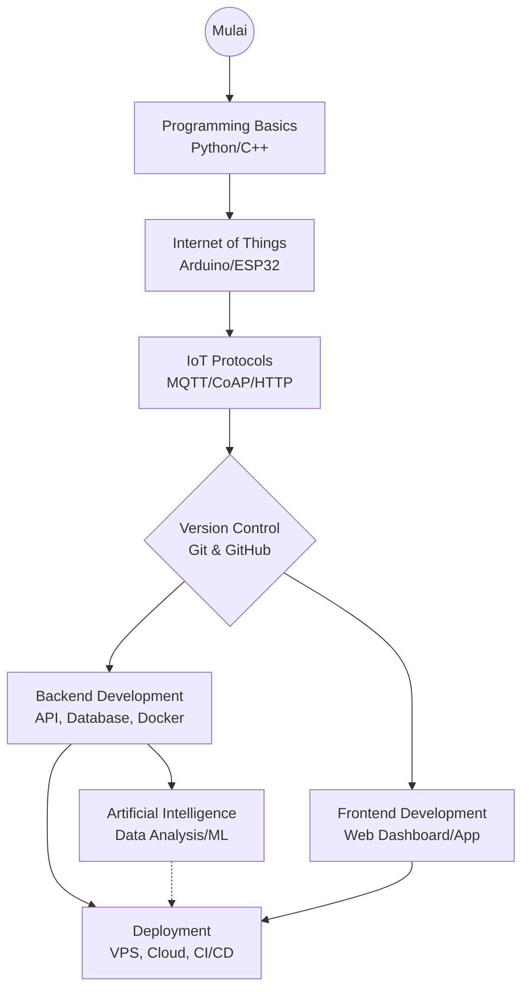

# Selamat datang di Modul AIoT

Modul AIoT ini dirancang untuk memberikan pemahaman mendalam tentang konsep dan praktik dalam bidang Artificial Intelligence dan Internet of Things. Melalui modul ini, Kamu akan mempelajari berbagai aspek teknis dan teoritis yang diperlukan untuk mengembangkan sistem AIoT.

Repositori: [Repo belajar](https://github.com/IoT-Smart-Hydroponic/learning)

## Daftar Isi

- [Getting Started](getting-started/overview.md)
- [Internet of Things (IoT)](iot/overview.md)
- [Protocol](protocol/overview.md)
- [Version Control](version-control/overview.md)
- [Backend Development](backend/overview.md)
- [Frontend Development](frontend/overview.md)
- [Artificial Intelligence (AI)](ai/overview.md)
- [Deployment Overview](deployment/overview.md)
- [Contribute](guide.md)

## Tentang Modul Ini

Modul ini dibuat untuk membantu Kamu memahami konsep-konsep dasar dan lanjutan dalam AIoT. Setiap bagian modul dirancang untuk memberikan pengetahuan praktis yang dapat langsung diterapkan dalam proyek-proyek nyata. Kami berharap modul ini dapat menjadi sumber belajar yang bermanfaat bagi Kamu yang tertarik dalam bidang AIoT. Selamat belajar! 🚀

!!! tip "Tips Belajar"
    Kamu tidak perlu menguasai semua modul sekaligus. Pilihlah modul yang paling sesuai dengan kebutuhan proyek dan minat Kamu. (Kalau bisa sih semuanya 😄)

    Jika Kamu memiliki pertanyaan atau butuh bantuan, jangan ragu untuk bertanya dan berdiskusi ya! Feel free to ask us anytime.

## Rekomendasi Alur Belajar

