# Internet of Things (IoT)

Internet of Things (IoT) merupakan sebuah konsep yang merujuk pada sekelompok perangkat fisik yang terhubung ke internet, memungkinkan mereka untuk mengumpulkan, bertukar data, dan berinteraksi satu sama lain. Perangkat IoT dapat menyerupai benda sehari-hari seperti sensor, peralatan rumah tangga (smart home devices), kendaraan, dan banyak lagi. Dengan kemampuan untuk terhubung ke internet, perangkat IoT dapat memberikan berbagai manfaat, termasuk:

- **Otomatisasi**: Perangkat IoT dapat diatur untuk melakukan tugas-tugas tertentu secara otomatis, seperti menyalakan lampu saat seseorang memasuki ruangan atau mengatur suhu ruangan berdasarkan preferensi pengguna.
- **Pemantauan Jarak Jauh**: Perangkat IoT memungkinkan pemantauan kondisi dan status perangkat dari jarak jauh, seperti memantau kondisi tanaman saat bepergian atau mengawasi sistem keamanan rumah.
- **Pengumpulan Data**: Perangkat IoT dapat mengumpulkan data secara real-time, yang dapat digunakan untuk analisis lebih lanjut guna meningkatkan efisiensi operasional atau membuat keputusan yang lebih baik.

```mermaid
architecture-beta
    service sensor(material-symbols:motion-sensor-active)[Sensor IoT]
    service server(carbon:ibm-cloud-bare-metal-server)[Server Cloud]
    service database(material-symbols:database)[Database]
    service dashboard(material-symbols:analytics)[Dashboard Monitoring]

    sensor:R --> L:server
    server:B <--> T:database
    server:R --> L:dashboard
```

